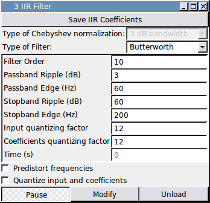

###IIR Analog Filters

**Requirements:** None  
**Limitations:** [DSP Libraries](https://github.com/RTXI/dsp-lib) (included) 

This module computes coefficients for three types of filters. They require the following parameters:

1. Butterworth: passband edge
2. Chebyshev: passband ripple, passband edge
3. Elliptical: passband ripple, stopband ripple, passband edge, stopband edge

You may save the computed coefficients and the filter’s parameters to a file.

The Butterworth filter is the best compromise between attenuation and phase response. It has no ripple in the pass band or the stop band, and because of this is sometimes called a maximally flat filter. The Butterworth filter achieves its flatness at the expense of a relatively wide transition region from pass band to stop band, with average transient characteristics.

The Chebyshev filter has a smaller transition region than the same-order Butterworth filter, at the expense of ripples in its pass band. The filter minimizes the height of the maximum ripple. If you use a Chebyshev filter, you should also choose the type of normalization to apply.

An Elliptical (Cauer) filter has a shorter transition region than the Chebyshev filter because it allows ripples in both the stop and pass bands, giving a much higher rate of attenuation in the stop band. Elliptical filters give better frequency discrimination, but have a degraded transient response.

####Input Channels

1. input(0) – “Input” : Signal to filter

####Output Channels

2. output(0) – “Output” : Filtered signal

####Parameters

1. Filter Order: an integer for the desired order for the filter
2. Passband Ripple (dB)
3. Passband Edge (Hz)
4. Stopband Ripple (dB)
5. Stopband Edge (Hz)
6. Input quantizing factor: the number of bits to which the input signal is to be quantized
7. Coefficients quantizing factor: the number of bits to which the filter coefficients are to be quantized

